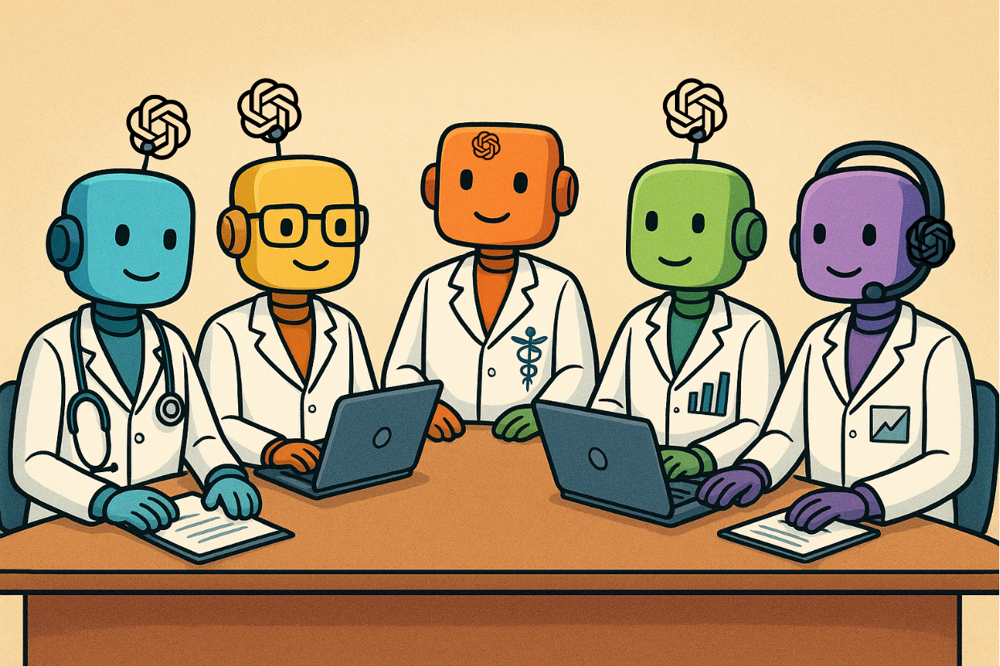

# IAged-Madrid
A virtual research team addressing statistical challenges in the exploitation of EHR databases. This initiative builds on the [Virtual lab](https://www.nature.com/articles/s41586-025-09442-9) framework, which is structured around meetings designed to conduct virtual experiments, but here it takes a step further: aiming to produce a IA generated scientific article.

## An experiment within an experiment
The IAged-Madrid virtual research group is a team of large language model (LLM) agents to assist an experiment design.

## How it works
The scenario is composed by 7 consecutive discussions, assisted by human user, since workflow design to the peer review process to obtain the final document.
* **Discussion 1:** Workflow design. In this first meeting of type **"individual_meeting"**, the user provide to the coordinator of the project, **the aim of the project** or the hypothesis to validate; a **dict database**, including the table names, and the column names of each table of the database. The last request is obtain the **deliverable**, a **provisional workflow**.
  
* **Discussion 2:** Refine the initial workflow. In this meeting of type **"group_meeting"**, also the provisional workflow is provided with the goal of refine it including all members team's insights. A conversational **scheme** is provided, explaining how much rounds of interventions and which team members will intervene throgout the meeting. These members will share their thoughts with the rest of members. The coordinator will convene the meeting, acting as moderator. The last request is obtain the **deliverable**, a **definitive workflow**.
  
* **Discussion 3:** Define a methodology. In this **"group_meeting"**, the experts that will develop the statisticals methods, will define how they will do. They will discusse about the procedure, the variable selection, the tools, the programming language, following a conversational **scheme**, this time with less interventors. he **coordinator** will convene the meeting, acting as moderator. At the end, the coordinator will synthesize the decissions in a summary, as **deliverable**.
  
* **Discussion 4:**
  * *Phase A:* In this phase, given a methodology/procedure to follow, *developers* will distribute the tasks and split the pipeline to follow in scripts. They will do in a conversation following the scheme provided. This time, the meeting will convened by one of the developers, acting as **moderator**. At the end the moderator will provide a python list of tuples, with each script_name\[0] assign to a responsible agent\[1].
  *  *Phase B:* In this phase, some team members will answer questions raised along phase A, contributing to solve doubts about some relevant decissions made in the code. The **deliverable** is a summary of solver questions.

* **Discussion 5:** Due to the 4 phase-b deliverable, this **working-session** meeting follow a scheme, in which the moderator inite the meeting to start the code development phase. Then a conversation with num_rounds = len(deliverable) starts, developing all scripts purposed in the phase A of 4th discussion. At the end, the moderator summarizes all relevants details to the methodology section.

From this thread (5), the scripts are recovered, saving each script_name and content in script files. Then, the human user executes the scripts in local, and save the results of the workflow in a string called "results", that will serve as input in the nex discussion 

* **Discussion 6:** Writting a draft
  * *Phase A:* A **group-meeting** discussion to gather team members' insights to include their perspectives and conclussions about the results in the manuscript, following a scheme conversation.
  * *Phase B:* Following the same thread (6-phaseA), the coordinator starts to write the manuscript iterating a **dictionary of sections**, that include the section names as keys, and instructions about how to address the section drafting as values.

From this thread (6), the manuscript is recovered, saving all section_name and content in a string.

* **Discussion 7:** This discussion simulates a peer review process. The discussion starts asking to moderator embedding the manuscript in the latex template for the conference. Then, 2 round of review comments by two reviewers happen. The discussion ends with the coordinator editing the manuscript, to refine it based on reviewers comments. The deliverable is the final revised manuscript, ready to submit for the conference.

## An experiment within an experiment
The IAged-Madrid virtual research group is composed of large language model (LLM) agents assisting with experiment design.

## How it works
The process consists of 7 consecutive discussions, supported by a human user, spanning from workflow design to peer review to produce the final document.

* **Discussion 1: Workflow design.**  
  An **"individual_meeting"** where the user provides the project coordinator with the **aim of the project** or the hypothesis to be tested, as well as a **dictionary of database tables** with their corresponding column names. The deliverable is a **provisional workflow**.

* **Discussion 2: Refining the workflow.**  
  A **"group_meeting"** where the provisional workflow is reviewed and improved with input from all team members. A conversational **scheme** specifies the number of intervention rounds and the roles of participants. Members share their insights, and the coordinator moderates the session. The deliverable is a **definitive workflow**.

* **Discussion 3: Methodology definition.**  
  A **"group_meeting"** where statistical experts define the procedures, variable selection, tools, and programming languages to be used. A conversational **scheme** with fewer participants guides the discussion. The coordinator moderates and compiles the **deliverable**, a summary of decisions.

* **Discussion 4:**  
  * *Phase A:* Developers distribute tasks and divide the pipeline into scripts, following the agreed methodology. A developer moderates this session. The deliverable is a Python list of tuples pairing each `script_name` with its responsible agent.  
  * *Phase B:* Team members address questions raised during Phase A, clarifying coding decisions. The deliverable is a summary of resolved issues.

* **Discussion 5: Code development.**  
  A **working session** where the moderator initiates the coding phase. A conversation proceeds with `num_rounds = len(deliverable)` to implement all scripts defined in Discussion 4. The moderator summarizes key details for inclusion in the methodology section.  
  The resulting scripts are saved, and the human user executes them locally. Workflow results are stored in a string called `"results"`, which serves as input for the next discussion.

* **Discussion 6: Drafting the manuscript.**  
  * *Phase A:* A **group_meeting** where members share their perspectives and conclusions about the results, following a structured conversation.  
  * *Phase B:* Continuing from Phase A, the coordinator drafts the manuscript iteratively using a **dictionary of sections**, where keys are section names and values are drafting instructions.  
  The draft manuscript is saved, storing each `section_name` and its content in a string.

* **Discussion 7: Peer review simulation.**  
  The manuscript is embedded in the conference LaTeX template. Two review rounds are conducted, with comments from two reviewers. The coordinator then revises the manuscript based on feedback. The deliverable is the **final, conference-ready manuscript**.

